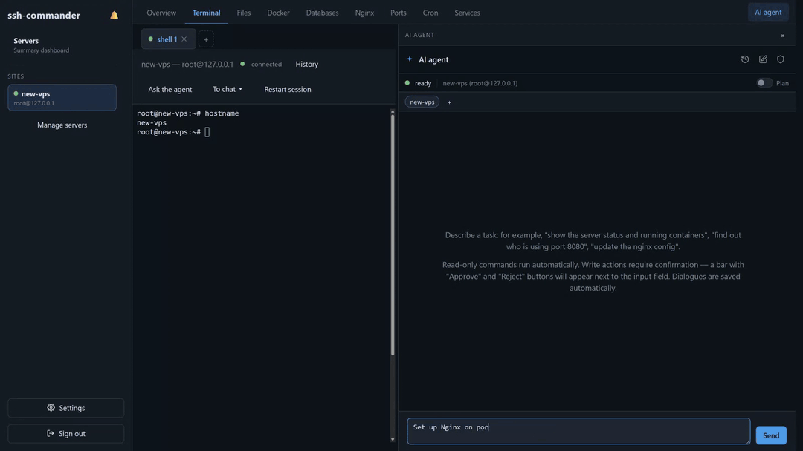
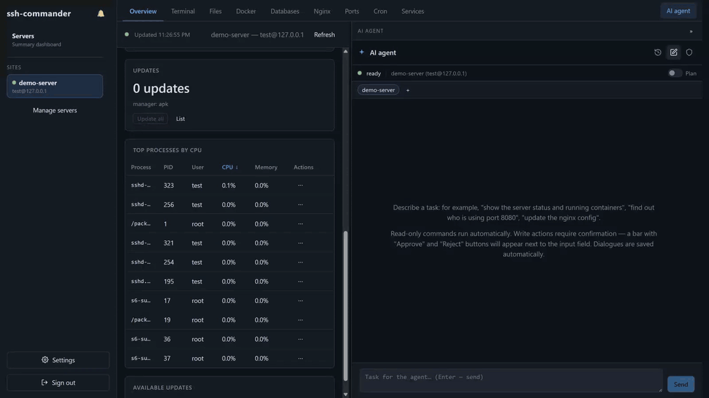
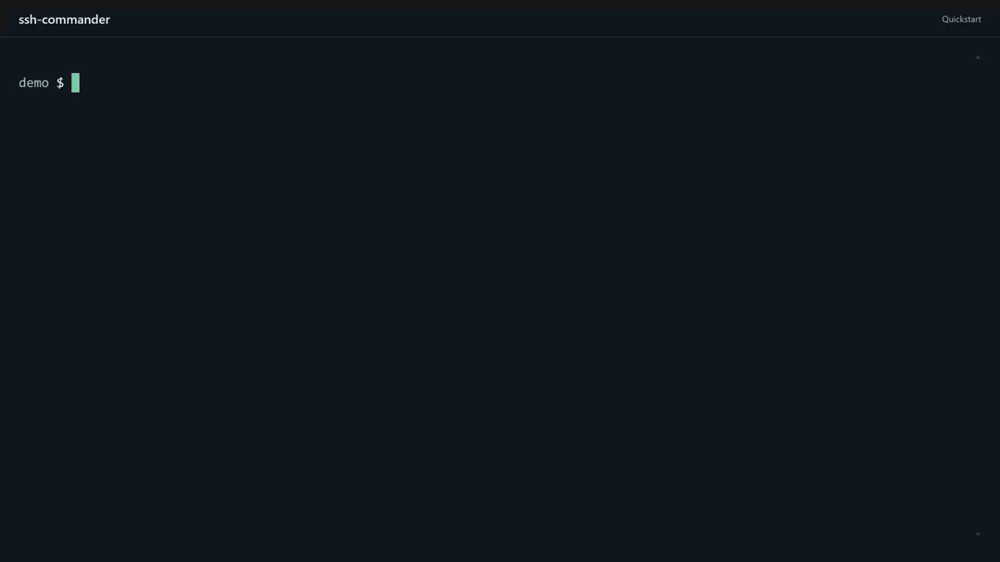

# ssh-commander

**English** · [Русский](README.ru.md)

[](https://github.com/lexuss1979/ssh-commander/actions/workflows/ci.yml)

## Your personal AI DevOps

**Get your project running on a VPS, and get help when something breaks.** You don't have to become a Linux administrator first.

Describe what you need. ssh-commander's AI agent connects to your server over SSH, investigates problems, runs audits, and carries out fixes **with your approval**. From your first VPS to several project servers, you have a helper that works on the actual machine, not just a chat that tells you what to try.

**Free, open-source app. No ssh-commander subscription.** You pay for your servers and AI API usage with your own key.

[](docs/media/hero-new-vps.mp4)

**A new server. One request. A working website.** The agent installs Nginx, creates the page, and checks that it works. You approve the changes, then open the site. [Watch the demo (MP4, 45 sec)](docs/media/hero-new-vps.mp4). Recorded on a clean SSH test server; waiting and intermediate steps are shortened.

> [!TIP]
> **Try it without AI first.** The terminal, files and Docker work without an API key. Get familiar with the app, then enable the agent in **Settings** when you're ready.
>
> SSH access is needed from the start to work with your server. Enabling AI is a separate step: the agent uses the selected SSH user's permissions and asks you to approve changes.

- Runs locally on your computer.
- Changes require your approval; review the command and target server.
- Automatic read-only access is limited by an allow-list.
- AI prompts and tool results go to your configured provider.
- SSH/database passwords and the API key are stored in plaintext in local data files.

Details: [Security policy](SECURITY.md). Approval and redaction do not guarantee safety.

## Bring the problem, not a pile of logs

In a separate chat, you're often the go-between: copy an error, get a command, run it, paste the output, repeat. Here, the agent can inspect the server itself. It reads logs, checks services and containers, and follows the evidence before proposing a fix.

Start with a task in your own words:

- **Your first VPS:** "I've rented a server. Check what's installed and help me get my app running."
- **Something broke:** "My site stopped responding. Find out why and propose a fix."
- **A second pair of eyes:** "Audit this server's security and explain what needs attention. Don't change anything yet."

You don't need to know which command to run before asking for help. The agent does the investigation; you review the proposed changes. You can also open the terminal, files or Docker Explorer and take over whenever you need to.

[](docs/media/hero-disk-full.mp4)

**Disk full?** The agent investigates, finds a large log, asks before clearing it, and checks the result. [Watch the troubleshooting demo (MP4, 26 sec)](docs/media/hero-disk-full.mp4).

## One VPS or several

Keep your project servers in one app, with per-server agent memory. Attach multiple servers to a conversation when a task spans them. Monitoring and threshold alerts help you spot problems; ask the agent to investigate when you need help.

This is an interactive assistant, not an autonomous 24/7 on-call service. It can make mistakes: review commands before approving them and keep backups.

## Quick start

Run ssh-commander **on your own computer** with Docker Compose v2. The prebuilt **0.1.1** image supports amd64/arm64; Git and Node/npm are not required. Connect it to a Linux VPS you already have; the app does not rent servers for you.

Linux/macOS:

```bash
mkdir ssh-commander
cd ssh-commander
curl --fail --location https://raw.githubusercontent.com/lexuss1979/ssh-commander/v0.1.1/docker-compose.release.yml --output compose.yaml
docker compose up -d
```

Windows PowerShell:

```powershell
New-Item -ItemType Directory ssh-commander
Set-Location ssh-commander
Invoke-WebRequest -UseBasicParsing -Uri 'https://raw.githubusercontent.com/lexuss1979/ssh-commander/v0.1.1/docker-compose.release.yml' -OutFile compose.yaml
docker compose up -d
```

[Backups, updates and source-build migration](docs/installation.en.md) · [Build from source](docs/installation.en.md#source-build).

Open [http://localhost:8080](http://localhost:8080), set an app password, and add your AI provider's API key. Add your server's SSH address and credentials, then ask the agent to check its current state. No `.env` file is needed. You can skip the AI key and still use the terminal, files and other manual tools.

**Step by step:** [your first server and task](docs/getting-started.md) covers SSH access, AI setup, action approvals and common problems.

[](docs/media/quickstart.mp4)

[Watch the Quickstart demo (MP4, 37 sec)](docs/media/quickstart.mp4). This demo shows the source-build installation, skips the AI key and connects to a test server; add your key in Settings to use the agent.

To change the password or AI provider/key/model later, open **Settings** using the gear at the bottom of the sidebar. Changes apply without a restart. Configuration is stored in `data/settings.json`.

For environment-based setup, copy `.env.example` to `.env` **before the first launch** and edit it. Replace the sample `APP_PASSWORD=change-me` with your own password, or leave it empty to use onboarding. `APP_PASSWORD` and `AI_API_KEY`/`AI_API_BASE`/`AI_MODEL` only seed settings on the first launch; changing them afterwards has no effect.

Notes:

- **SSH keys**: put them into `keys/`, or import them later via the UI (server form → "Import…", saved with `0600`). In a profile the key path is the in-container path, e.g. `/keys/id_rsa`. Key contents are never returned by the API.
- There is no need to build the frontend manually — the Dockerfile builds it inside the image.
- To update a prebuilt image, follow [the backup and update procedure](docs/installation.en.md#update). Source installations require `docker compose up -d --build` after code changes.
- SSH tunnels: the container publishes `127.0.0.1:10000-10049` (configurable via `TUNNEL_PORT_MIN`/`TUNNEL_PORT_MAX`) for forwarded ports.

## Cost and privacy

The app is free under the MIT license. AI usage is billed separately by your chosen provider; cost depends on the model and the task, and the app tracks estimated spending. You can use an OpenAI-compatible provider or a self-hosted model endpoint.

ssh-commander runs locally, is password-protected, and listens on `127.0.0.1` only. No ssh-commander account or telemetry. Application state stays on your machine, but **AI prompts and tool results are sent to your configured provider**. Do not expose the app to the internet; read [Security](#security) before use.

## Features

### Terminal
- Full PTY via xterm.js; several terminal tabs per server (up to 4); sessions survive page reloads.
- Command-history palette (Ctrl+R); send the last output or a selection to the AI agent in one click.

### File manager (SFTP)
- Browse, upload/download files **and whole directories** (tar.gz), inline editing with syntax highlighting (CodeMirror), create/rename/delete/chmod.
- Search by file name or content, live `tail -F` log viewing, "what's taking space" disk-usage explorer.

### Docker Explorer
- Containers, images, volumes, networks: start/stop/restart/remove, pull, run, prune, live logs (follow).
- `docker compose` (v2) up/down, a terminal inside a container, and a port overview that includes unpublished container-network-only ports.

### Databases
- PostgreSQL and MySQL connections: query, dump, and a read-only toggle per connection.

### Services (systemd)
- Full unit snapshot, start/stop/restart, enable/disable autostart, daemon-reload — with sudo — and live journal follow.

### Nginx
- Config discovery (native and inside containers), sites grouped by config file, certificate expiry dates, `nginx -t` check and safe reload.

### Ports & SSH tunnels
- Everything listening on the host plus container ports (published and container-network-only).
- One-click SSH port forwarding: `localhost:<port>` → remote service (TCP only).

### Cron & processes
- View/edit the user crontab; top processes on the Overview tab with TERM/KILL/HUP signals and renice.

### Package updates
- Snapshot of available updates (apt/dnf/yum/apk) and one-click apply, streamed live with sudo confirmation.

### AI agent
- OpenAI-compatible API with tool calling (OpenAI, OpenRouter, vLLM, DeepSeek, …).
- **Read-only tools run automatically; anything that mutates (write a file, run a command, docker action, connect a server) waits for your approve/reject in the UI.** A conservative allow-list filters what read-only commands may even run.
- Plan mode: the agent proposes a plan first, you approve it, then it executes.
- Per-profile persistent memory (`MEMORY.md`, loaded into context at session start); secrets are never written to it.
- Web search built in with the DeepSeek preset (same key); cost tracking per dialogue, suggested-reply hints.
- The agent language matches the UI language (Settings → Interface).

### Servers
- Multiple SSH profiles (password or key auth), key import from the UI (saved with `0600`), one-click bootstrap of a new server (root + password), saved command snippets that run on several servers at once, threshold alerts with a sidebar bell (availability/disk/memory/load).

### Localization
- UI in English and Russian, dark and light themes. Switch in Settings → Interface (gear at the bottom of the sidebar), no reload; the default language follows the browser locale.

## Configuration

Environment variables are set via `.env` (template: `.env.example`); inside the container they come from `environment` in `docker-compose.yml`.

| Variable | Default | Description |
|---|---|---|
| `APP_PORT` / `APP_HOST` | `8080` / `127.0.0.1` | HTTP/WS port and bind address. The default is loopback; the Docker image sets `0.0.0.0` internally so the published port works. A non-loopback address prints a warning at startup |
| `APP_PASSWORD` | empty | Password for the web UI. **Seed only, first start**: hashed into `data/settings.json`; empty — set via onboarding. Afterwards env is ignored; change it in Settings → Security |
| `DATA_DIR` | `/data` (docker) | Directory with `settings.json`, `profiles.json`, `db-connections.json`, `ai-dialogues.json`, `memory/`, … |
| `KEYS_DIR` | `/keys` (docker) | Directory with SSH keys |
| `WEB_DIST` | auto-detected | Path to the built frontend |
| `AI_API_BASE` | `https://api.deepseek.com/v1` | Base URL of an OpenAI-compatible API. **Seed only, first start** (with the key it picks the provider preset); afterwards — `data/settings.json` |
| `AI_API_KEY` | empty | API key; without it (in settings or seed) the agent is unavailable. **Seed only, first start**; afterwards — `data/settings.json` |
| `AI_MODEL` | `deepseek-v4-flash` | Agent model. **Seed only, first start**; afterwards — `data/settings.json` |
| `AI_MAX_STEPS` | `30` | Step limit of the agent loop |
| `AI_TEMPERATURE` | `0.2` | Model temperature |
| `AI_SEARCH_API_BASE` | empty | Anthropic-compatible web-search endpoint (env-only). The DeepSeek preset has search built in — same key, no env needed; this variable is for other providers (e.g. OpenAI chat + DeepSeek search). Empty and not DeepSeek — search is disabled and the tool is not announced to the model |
| `AI_SEARCH_MODEL` | `deepseek-v4-flash` | Model used for web search |
| `TUNNEL_PORT_MIN` / `TUNNEL_PORT_MAX` | `10000` / `10049` | Port range for SSH tunnels (local end) |

### Data storage

Server profiles live in `data/profiles.json` (volume `./data`), DB connections in `data/db-connections.json`, saved snippets in `data/snippets.json`, agent dialogues in `data/ai-dialogues.json`, the AI usage/cost journal in `data/ai-usage.json`, and agent memory in `data/memory/<profileId>/MEMORY.md`. App configuration (web password hash, AI provider/key/base/model) lives in `data/settings.json` — the single source of truth at runtime. SSH keys are mounted from `./keys` into `/keys` inside the container, and a profile's key path must stay inside that directory. Host key fingerprints live in `data/known-hosts.json`. Every file under `data/` is written with `0600`, and startup fixes the permissions of files left by older versions.

## Security

**Read this before exposing anything.**

- The app binds **`127.0.0.1` by default** and `docker compose` publishes it only there — it is not reachable from the network. Don't change the port mapping or `APP_HOST` unless you understand the risk: this tool is not built to be exposed.
- SSH host keys are verified on the **trust-on-first-use** model, like `ssh(1)`: the first key is remembered in `data/known-hosts.json`, and a changed key aborts the connection instead of handing your password to whoever answered.
- Requests from another origin are rejected on both the API and the WebSocket handshake, so a page in another tab cannot drive your terminal.
- It is a **single-user local tool**: SSH passwords and key passphrases are stored **in plain text** in `data/profiles.json`; database passwords likewise in `data/db-connections.json`. Never publish the `data/` volume and never expose the container beyond localhost. The API never sends those secrets back to the browser — a saved secret shows as “set”, and an empty field means “keep it”.
- A profile backup contains your SSH passwords and the private keys themselves, so exporting with secrets **requires an encryption passphrase**; without one you get a backup without secrets.
- SSH tunnels open an **unauthenticated listener** on `127.0.0.1:<port>` — any local process or user can reach the forwarded service without the app password (the same trust model as a local terminal).
- The AI agent **never executes mutating actions without your approval**; auto-run read-only commands pass a conservative **allow-list** (reading utilities only — no interpreters, no network clients). Reading a file that looks like a secret store (`.env`, private keys, `.pgpass`) asks for approval too.
- Secret values are **stripped from tool output** before it reaches the model, the UI or `data/ai-dialogues.json`: PEM private keys, `NAME=value` pairs with a telling name, known token shapes, passwords in URLs, and every `Env` value in `docker inspect`. The same filter runs on `write_memory`, so the agent's memory cannot store secrets — enforced in code, not only asked for in the prompt. Redaction is pattern-based: treat it as a safety net, not a guarantee.
- Web search sends query text to an external search API. It is enabled automatically with the DeepSeek preset. For other presets it is enabled only when `AI_SEARCH_API_BASE` is set; to disable search, use a non-DeepSeek preset and leave that variable empty.
- Exposing this tool to the internet is a reliable way to get your servers compromised. Don't.

## Support

Published as-is. Maintained on a best-effort basis by the author — issues and PRs are welcome, but there is no SLA. Found and fixed something? A PR is the best way to make it stick.

## Development

```bash
# server (API + WebSocket on :8080)
cd server && npm install && npm run dev

# frontend with hot reload (Vite on :5173, proxies /api and /ws to :8080)
cd web && npm install && npm run dev
```

Tests and checks:

```bash
cd server && npm test        # vitest unit tests
cd web && npm run lint       # eslint
```

Pre-commit hooks (eslint + tsc + vitest + web build on every commit):

```bash
bash scripts/install-hooks.sh
```

## License

MIT — see [LICENSE](LICENSE).
